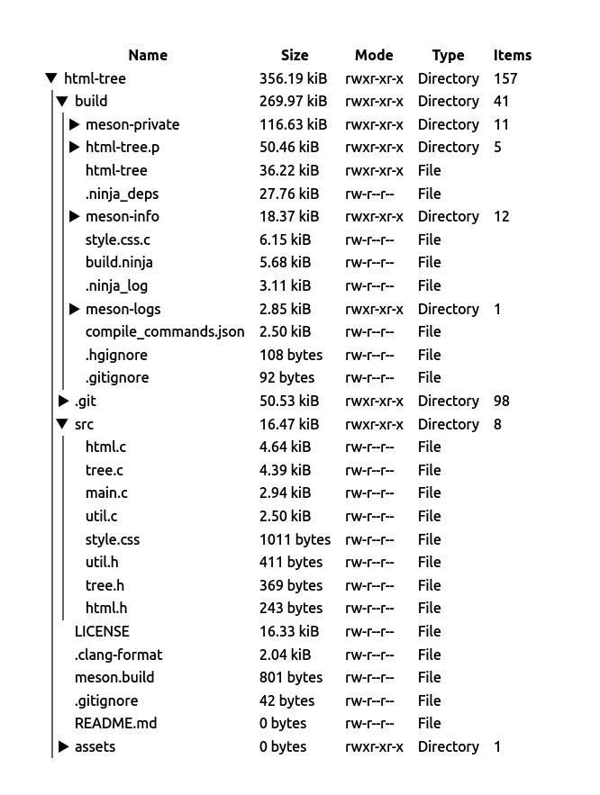

<div align="center">
    <h3 align="center">html-tree</h3>
    
    
</div>

---
<br/>



## About
This program generates a HTML document from a directory tree.

## Features
- Lists file size in order
- Shows mode and other file attributes

## TODO
- [ ] Handle large directory trees better
- [ ] Minify HTML output
- [ ] Show extra file attributes
    - [ ] Show file modification/creation/access time in the user's locale
    - [x] Show owner/group (UID/GID)
    - [x] Show symlink target
- [x] Permissions in monospace font
- [ ] Toggleable columns
- [ ] Toggleable dark mode (not sure if this is possible without JS)
- [x] Fix wrapping with long file names
- [ ] Add animations to expanding/collapsing directories

<br />

## Installing
### Debian-based
```bash
sudo apt install build-essential meson
```
Then follow the instructions below

### Other distros
```bash
git clone https://github.com/mekb-turtle/html-tree.git
cd html-tree
meson setup build
meson install -C build
```

